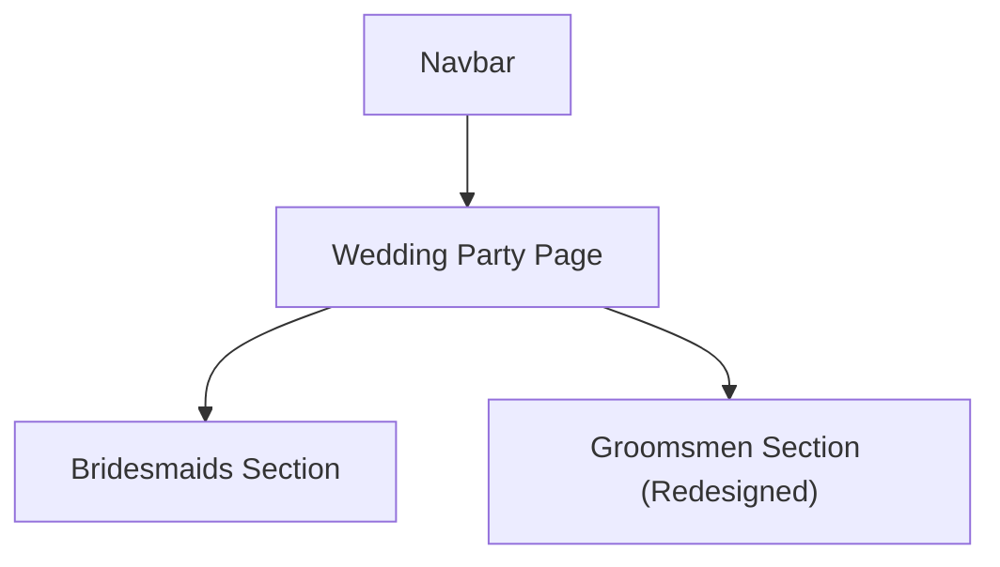

## 1. Product Overview

Redesign the **Wedding Party** page to better present the groomsmen section.
Keep the existing global **navbar and footer**, and **remove any Ring Bearer / Children section** from this page.

## 2. Core Features

### 2.1 Feature Module

1. **Wedding Party page**: hero intro, bridesmaids section (unchanged), improved groomsmen layout, global navbar/footer (unchanged), no ring bearer/children section.

### 2.2 Page Details

| Page Name     | Module Name                  | Feature description                                                                                                                                                                            |
| ------------- | ---------------------------- | ---------------------------------------------------------------------------------------------------------------------------------------------------------------------------------------------- |
| Wedding Party | Global header (Navbar)       | Keep existing navbar behavior, links, and styling unchanged.                                                                                                                                   |
| Wedding Party | Hero                         | Present page title and short intro text.                                                                                                                                                       |
| Wedding Party | Bridesmaids section          | Keep existing layout/content unchanged.                                                                                                                                                        |
| Wedding Party | Groomsmen section (Redesign) | Improve desktop layout readability and visual balance. • Feature “Best Man” as a prominent card. • Present remaining groomsmen as consistent cards with aligned image heights and text blocks. |
| Wedding Party | Content cleanup              | Remove Ring Bearer / Children section entirely (no heading, cards, or placeholders).                                                                                                           |
| Wedding Party | Global footer                | Keep existing footer behavior and styling unchanged.                                                                                                                                           |

## 3. Core Process

User flow:

* Use the navbar to open **Wedding Party**.

* Scroll through hero, bridesmaids, then the redesigned groomsmen section.

