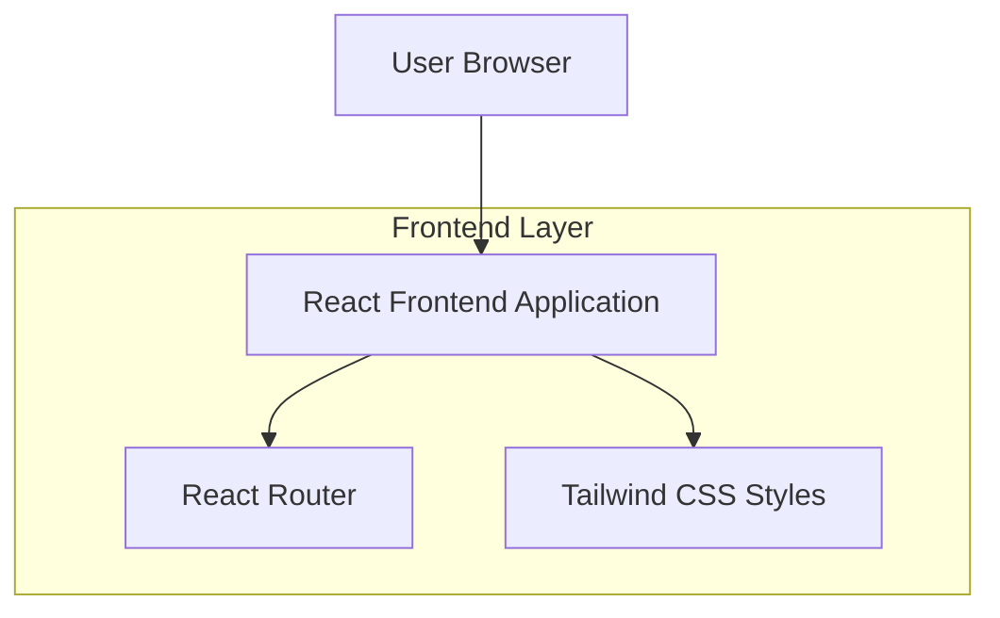

## 1.Architecture design

## 2.Technology Description
- Frontend: React@19 + react-router-dom@7 + tailwindcss@3 + vite
- Backend: None

## 3.Route definitions
| Route | Purpose |
|-------|---------|
| / | Home page |
| /our-story | Our Story page |
| /guestbook | Guestbook page |
| /wedding-party | Wedding Party page (includes the groomsmen layout redesign) |
| /order-of-events | Order of Events page |
| /rsvp | RSVP page |